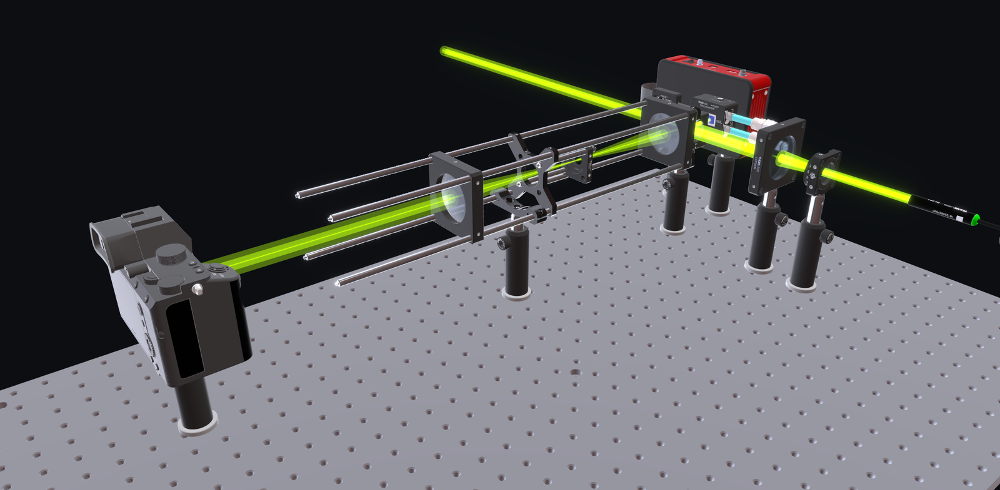
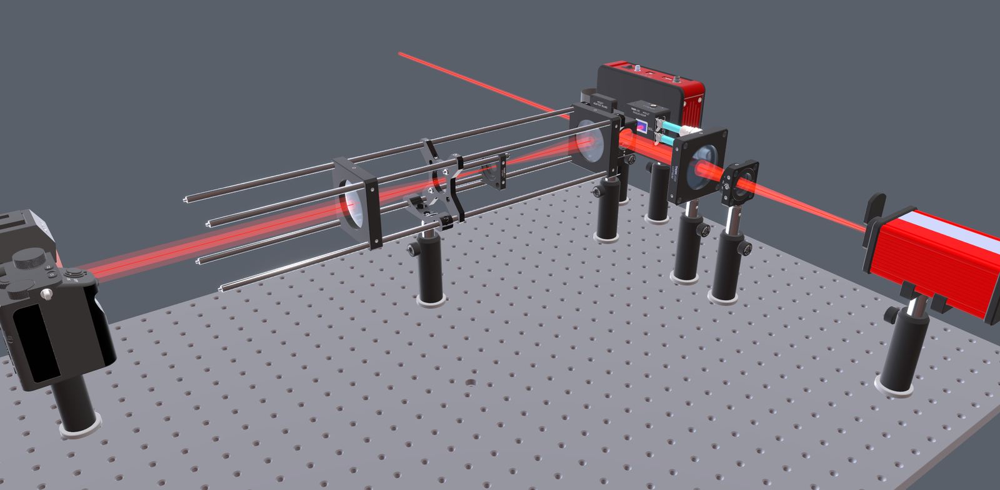
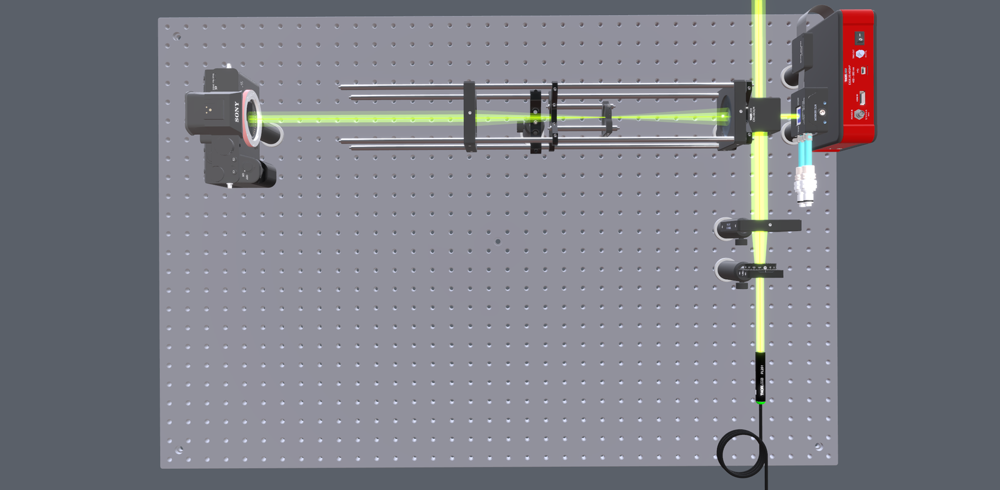

# OpticalTwin

[](https://github.com/itotlab-system/opticaltwin-core/actions/workflows/ci.yml)
[](https://doi.org/10.5281/zenodo.21594827)
[](https://opensource.org/licenses/Apache-2.0)
[](https://www.python.org/)
[](https://nodejs.org/)

Interactive 3D viewer and editor for **optical laboratory setups**, built on
[OpenUSD](https://openusd.org/) and [React Three Fiber](https://r3f.docs.pmnd.rs/).

Open a shared setup in a browser, place real optical components at physically
correct positions on a breadboard, check fit, spacing and alignment, and discuss
the layout with colleagues — without needing to be in the optics room.



<sub>A 4f imaging layout. Rendered with manufacturer CAD imported — a fresh clone
shows procedurally generated shapes at the same dimensions until you import CAD
of your own (see [Using manufacturer CAD models](#using-manufacturer-cad-models)).
The beam is a **planning line**, not a simulation.</sub>

- **Stack:** React + React Three Fiber (frontend) · Flask + OpenUSD (backend) · Git (sync)
- **Conventions:** millimetres · Z-up · optical axis along +X
- **License:** Apache-2.0

## Who this is for

Research groups who build optical setups on breadboards and need to plan, share
and argue about them away from the bench — a supervisor reviewing a student's
layout, a group deciding whether a new arm will fit before ordering parts, or
anyone who wants a figure of a setup for a paper without rebuilding it in CAD.

It is most useful to a lab that already owns the parts: components are described
with real dimensions, so what fits on screen fits on the table.

## Scope

OpticalTwin is a tool for **layout and planning**, not an optical design suite.
Beam paths are drawn as straight planning lines between components; there is no
ray tracing, refraction or diffraction modelling.

This is a deliberate boundary, not a missing feature. Zemax, Code V and
OpticStudio do optical design far better than we could, and the tool is useful
precisely because it stays small enough to open, edit and share in a browser.

**What it does:** place components at real positions and dimensions · check fit,
spacing and alignment · fold beams geometrically at mirrors and beamsplitters ·
group, copy and rearrange parts · keep everything in text files that diff and
merge in git · share a setup with the group over a LAN.

**What it does not do:** refraction · focusing · diffraction · ray tracing ·
tolerancing · aberration analysis · anything else that belongs in optical design
software.

## What it looks like

The same bench from above, and viewed from the top. Beam colour follows the
source's `optics:wavelength_nm`, so a 633 nm source draws red and a 532 nm source
draws green.

| | |
|---|---|
|  |  |
| Wavelength drives the beam colour. | Top-down, where spacing and alignment are easiest to judge. |

The 90° turn at the beamsplitter is a **geometric fold** — the tracer reflects
the line off components that change direction and passes it through the ones that
do not. There is no physics behind it beyond that.

---

## Quick start

Requires **Python 3.12** and **Node 20**.

```bash
# 1 — Python backend
python3.12 -m venv .venv && source .venv/bin/activate
pip install -r requirements-app.txt
python setup_projects.py    # generates components/ and an example project
python server.py            # http://localhost:8000

# 2 — React frontend (separate terminal)
cd app
npm install
npm run dev                 # http://localhost:5173
```

Open **http://localhost:5173/**. Vite proxies `/api` and `/model` to the backend.

For a production build, run `npm run build` in `app/` — the backend then serves
`app/dist/` directly on port 8000, and the frontend dev server is not needed.

### The component library is generated

`components/` is **not** checked in. `python setup_projects.py` builds the
catalogue from the `make_*` generators in `optics_lib.py` — lenses, mirrors,
beamsplitters, irises, detectors and so on, dimensioned to common
Ø1″ / 30 mm-cage standards. Re-run it any time to rebuild.

These are procedural shapes with correct dimensions, which is all the layout
needs. For parts that look like the real hardware, import manufacturer CAD.

### Using manufacturer CAD models

**No manufacturer CAD data is included in this repository.** Vendor-supplied
STEP models remain the property of their manufacturer, and their licence terms
generally permit use in your own design work but not redistribution.

What ships instead is a manifest of *pointers*. `cad/SOURCES.toml` lists the
parts the lab's own component library was built from — part number, vendor and
catalogue link — and `tools/fetch_cad.py` reads it:

```bash
python tools/fetch_cad.py --list      # what the manifest holds, and what is missing
python tools/fetch_cad.py             # download the entries that have a direct link
python tools/fetch_cad.py --part ER1  # just one
```

Most entries have no direct link, because most vendors do not offer a stable
one; for those the script prints the product page so you can save the STEP by
hand. Then convert it:

```bash
pip install cadquery-ocp   # large; only the CAD import path needs it
python cad_importer.py path/to/PART.step --type lens --lod both \
    --component-name MyPart
```

`cad/SOURCES.toml` is a good starting list even if your bench differs — edit it
to match the parts you actually own. See `docs/dev/ASSETS.md` for the full
conversion and optimisation guide.

### Access control

The server is open by default, which is only appropriate on a trusted network.
Set `OT_PASSWORD` to require a shared-password login:

```bash
OT_PASSWORD='your-password' python server.py
```

Also set `OT_SESSION_SECRET` to a fixed random value in any persistent
deployment, otherwise sessions are invalidated on every restart. The server
speaks plain HTTP — put it behind a reverse proxy with TLS if it is reachable
beyond a LAN.

`OT_PASSWORD` is one shared secret, not a user system: there are no accounts, no
per-project permissions and no audit trail. Read [SECURITY.md](SECURITY.md)
before deploying anywhere. **Do not expose this to the public internet.**

---

## How it works

USD is the single source of truth. Each optic is its own `.usda` asset in
`components/`; a setup in `projects/<name>/setup.usda` pulls them in via USD
**References**, so one asset can be placed many times. Every edit in the browser
is written straight back to the `.usda` file — the editor holds no hidden state,
and setups are plain text, so they diff and merge in git.

```
OpticalTwin/
├── server.py            # Flask backend — reads/writes USD, serves the REST API
├── optics_lib.py        # component generators and setup helpers
├── templates.py         # named setup recipes
├── setup_projects.py    # scaffolds projects/<name>/setup.usda from a template
├── cad_importer.py      # STEP → USD component conversion
├── beam_tracer.py       # straight-line beam path resolution
├── usd_to_web.py        # setup .usda → .glb (glTF, Y-up)
├── cad/SOURCES.toml     # manufacturer CAD manifest (pointers, no CAD data)
├── tools/fetch_cad.py   # fetches the models listed in that manifest
├── app/                 # React + React Three Fiber frontend
├── web/                 # static viewer / earlier plain-HTML editor
├── components/          # generated component library (not checked in)
└── projects/            # one folder per setup (the live edited state)
```

Sync between people is plain git: commit `projects/<name>/` and pull each
other's. There is no database and no lock-in — if OpticalTwin disappeared
tomorrow, the setups are still readable USD.

## Tests

```bash
python -m unittest test_component_library test_beam_tracer test_cad_importer
cd app && npx playwright test     # browser end-to-end, starts the servers itself
```

The CAD import tests skip themselves unless `cadquery-ocp` is installed, so the
command above passes on a base install. Both suites run in CI on every pull
request.

## Roadmap

Near-term, roughly in order:

- Refine placeholder component dimensions against real part numbers
- Render components procedurally in the client from the API, so every part is
  individually selectable and draggable rather than baked into one glb
- Model posts and mounts, so beam height reflects how things are really held
- Geometry-only validation: are components on-grid, is the beam inside each aperture
- Migrate the backend to FastAPI for live multi-user editing over WebSocket

[Open an issue](https://github.com/itotlab-system/opticaltwin-core/issues) if you
need something on this list sooner, or something that is not on it.

## Contributing

Issues, questions and pull requests are welcome. Please read
[CONTRIBUTING.md](CONTRIBUTING.md) first — this repository is a periodic export
of the lab's development repository, which affects how pull requests are merged
and credited. [CHANGELOG.md](CHANGELOG.md) records what changed in each release.

By participating you agree to the [Code of Conduct](CODE_OF_CONDUCT.md).

---

## Citation

All four authors contributed equally to this work.

If you use OpticalTwin in your research, please cite it as:

> Kumano, K., Yoshino, K., Goto, M., & Matsuo, Y. (2026).
> *OpticalTwin: a browser-based 3D viewer and editor for optical laboratory setups*
> (Version 1.0.0) [Computer software].
> Zenodo. https://doi.org/10.5281/zenodo.21594827

BibTeX:

```bibtex
@software{opticaltwin,
  author  = {Kumano, Kai and Yoshino, Kota and Goto, Masato and Matsuo, Yuto},
  title   = {{OpticalTwin: a browser-based 3D viewer and editor for optical laboratory setups}},
  year    = {2026},
  version = {1.0.0},
  doi     = {10.5281/zenodo.21594827},
  publisher = {Zenodo},
  url     = {https://github.com/itotlab-system/opticaltwin-core}
}
```

See `CITATION.cff` for machine-readable metadata — GitHub renders it as a
"Cite this repository" button. The DOI above is the concept DOI and always
resolves to the latest release, so it stays valid as versions change.

## Acknowledgements

Developed at the [Ito–Shimobaba–Wang Laboratory (ITOT lab.)](https://sites.google.com/view/ito-shimobaba-lab/home),
Graduate School of Engineering, Chiba University.

---

# OpticalTwin（日本語）

光学実験セットアップの 3D ビューア・エディタです。OpenUSD と React Three Fiber で
構築されています。ブラウザ上で共有セットアップを開き、部品を物理的に正確な位置に
配置し、フィット感・アライメントを確認して議論できます。


<sub>4f 光学系の作図例。メーカー CAD を取り込んだ状態のレンダリングです。クローン直後は
同じ寸法の簡易形状で表示されます（[メーカー CAD データについて](#メーカー-cad-データについて)）。
ビームは**作図上の直線**であり、シミュレーション結果ではありません。</sub>

- **単位:** ミリメートル · Z軸上向き · 光軸は +X 方向
- **ライセンス:** Apache-2.0

**想定利用者:** 光学系を組む研究グループ。実験室から離れた場所でレイアウトを検討・
共有・議論するためのツールです。部品は実寸で定義されているため、画面上で収まるものは
実際の定盤上でも収まります。

**スコープ:** レイアウトと配置計画のためのツールであり、光学設計ソフトではありません。
ビームは部品間の直線として描画され、光線追跡・屈折・回折の計算は行いません。これは
意図的な線引きです。光学設計には Zemax・Code V 等があり、本ツールはブラウザで開いて
編集・共有できる軽さにこそ価値があります。

## セットアップ

Python 3.12 と Node 20 が必要です。

```bash
python3.12 -m venv .venv && source .venv/bin/activate
pip install -r requirements-app.txt
python setup_projects.py    # components/ とサンプルプロジェクトを生成
python server.py            # http://localhost:8000

# 別ターミナルで
cd app && npm install && npm run dev   # http://localhost:5173
```

`components/`（部品カタログ）はリポジトリに含まれていません。`setup_projects.py` が
`optics_lib.py` の `make_*` ジェネレータから生成します。

## メーカー CAD データについて

**メーカー提供の CAD データは同梱していません。** ベンダーの STEP モデルは各社の
著作物であり、再配布は通常許可されていません。

代わりに、**入手先の一覧**を同梱しています。`cad/SOURCES.toml` に型番・メーカー・
製品ページを記載しており、`tools/fetch_cad.py` がそれを読み取ります。

```bash
python tools/fetch_cad.py --list      # 一覧と未取得の確認
python tools/fetch_cad.py             # 直リンクがあるものを取得
```

直リンクが無いものは製品ページを表示しますので、各自でダウンロードしてください。
取得後は `cad_importer.py` で USD に変換します（`docs/dev/ASSETS.md` 参照）。

## セキュリティ

サーバーは既定で認証なしです。共有パスワードによるログインを有効にするには
`OT_PASSWORD` を設定してください。ただしこれは**共有の合言葉であり、ユーザー認証では
ありません**（アカウント・権限・操作履歴はありません）。信頼できるネットワーク以外に
公開する場合は TLS 終端のリバースプロキシを前段に置いてください。
**インターネットへの直接公開は想定していません。** 詳細は [SECURITY.md](SECURITY.md)。

## 貢献

Issue・質問・Pull Request を歓迎します。本リポジトリは研究室内の開発リポジトリから
定期的に書き出された公開版であり、その都合で Pull Request の取り込み方が通常と
異なります。[CONTRIBUTING.md](CONTRIBUTING.md) を先にお読みください。

## 引用

研究で使用した場合は、上記 Citation 節の形式、または `CITATION.cff` を参照して
引用してください。DOI は **10.5281/zenodo.21594827** です（常に最新版を指します）。

## 謝辞

千葉大学 大学院工学研究院 [伊藤・下馬場・王 研究室（ITOT lab.）](https://sites.google.com/view/ito-shimobaba-lab/home)
にて開発されました。
